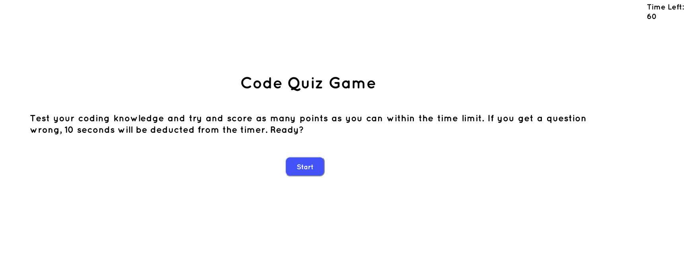

# Code-Quiz

# Description

Timed coding quiz app that saves high scores in local storage and generates an ordered list of scores when user submits their score and initials. Also tells user when they get a question wrong or right, and subtracts 10 seconds from the timer whenever an incorrect answer is selected. Game either ends when all questions have been answered or when time runs out. 

# Preview

# Installation

N/A

# License 

None

## Deployed Page Link

https://cmurphgarv.github.io/Code-Quiz/
